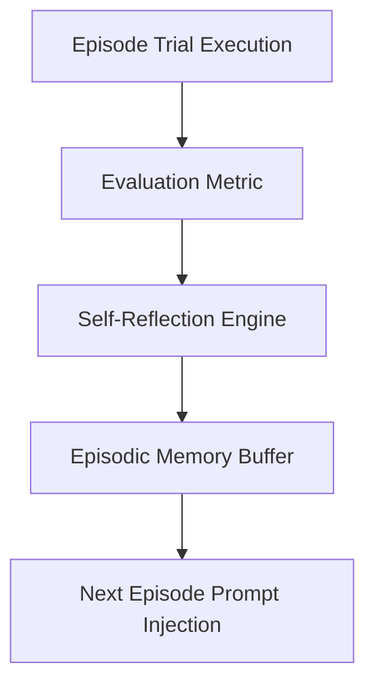

# Reflexion Episodic Memory Evaluator Skill

High-efficiency, zero-dependency Python implementation of the **Reflexion** architecture for verbal reinforcement learning and episodic memory accumulation.

## Features
- **Verbal Reinforcement Learning**: Converts numeric feedback and failure traces into structured natural-language self-critique.
- **Episodic Reflection Buffer**: Seeds subsequent attempts with reflected wisdom from historical trials.
- **Zero External Dependencies**: Pure Python standard library.
- **Native MCP Protocol**: JSON-RPC 2.0 stdio server compatible with Claude Desktop, Cursor, and Windsurf.

## Architecture

